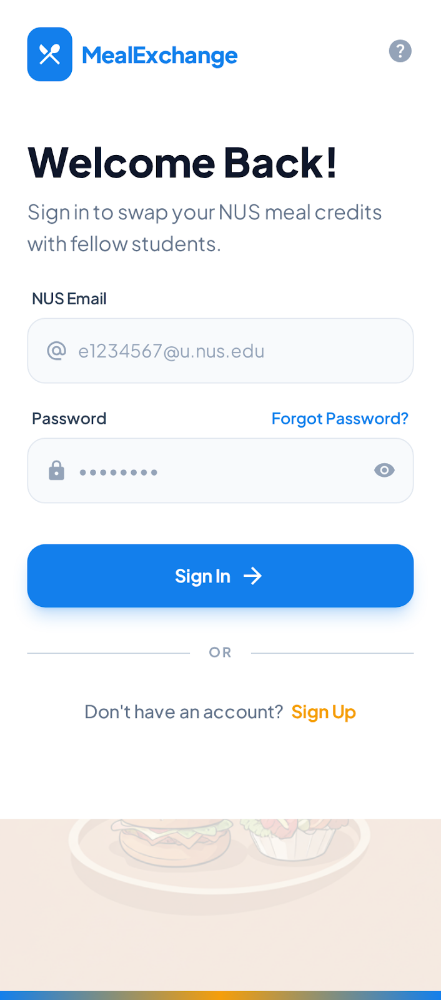
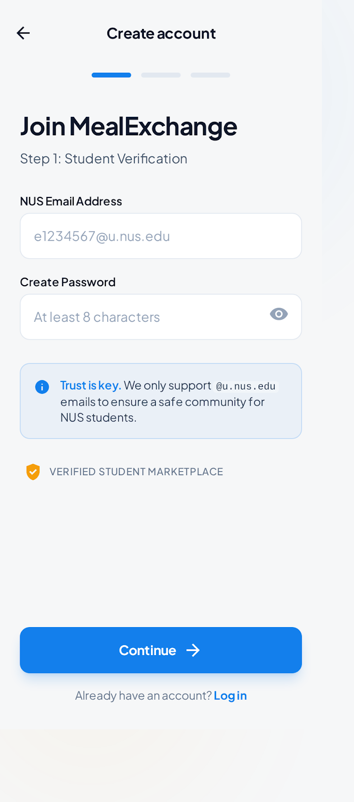
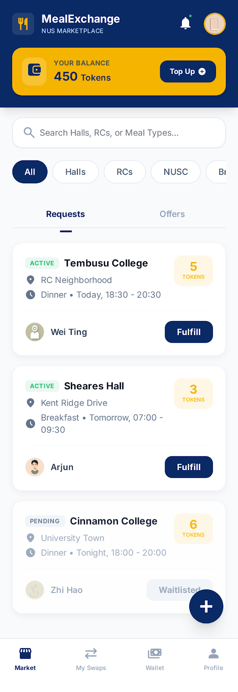
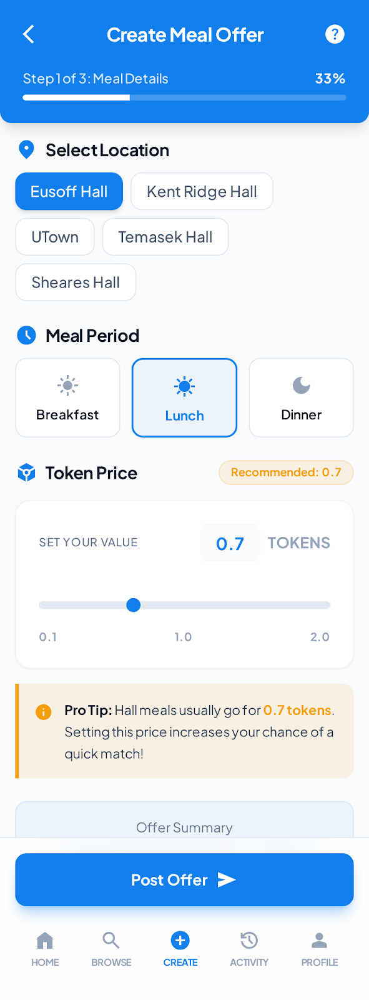
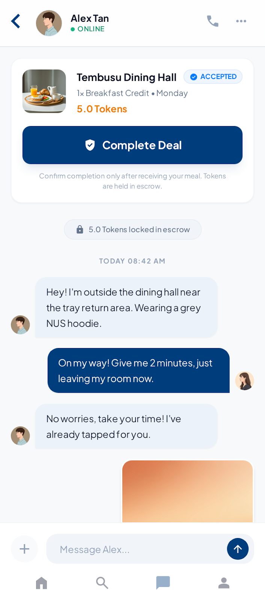
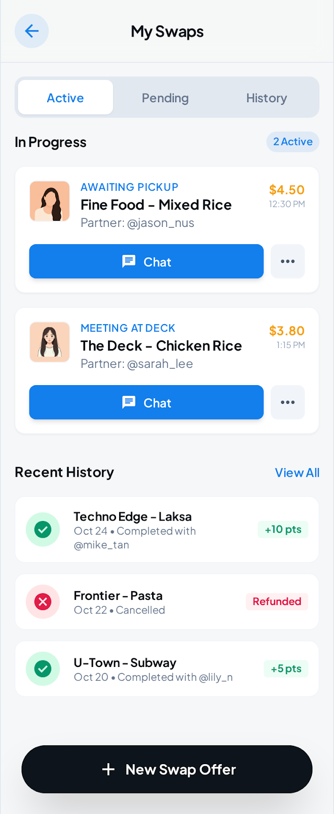
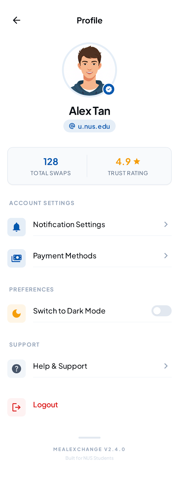

<div align="center">

# 🍽️ NUS MealExchange

### *Peer-to-Peer Meal Credit Exchange Platform for NUS Students*

[](https://www.typescriptlang.org/)
[](https://reactjs.org/)
[](https://vitejs.dev/)
[](https://supabase.com/)
[](https://nodejs.org/)

**🔗 [Live Demo](#) | 📖 [Documentation](#features) | 🐛 [Report Bug](https://github.com/EwenCheung/MealExchange/issues) | ✨ [Request Feature](https://github.com/EwenCheung/MealExchange/issues)**

</div>

---

## 📖 Table of Contents

- [About The Project](#-about-the-project)
- [Key Features](#-key-features)
- [Screenshots](#-screenshots)
- [Tech Stack](#-tech-stack)
- [Architecture](#-architecture)
- [Getting Started](#-getting-started)
  - [Prerequisites](#prerequisites)
  - [Installation](#installation)
  - [Environment Setup](#environment-setup)
  - [Running the Application](#running-the-application)
- [Database Schema](#-database-schema)
- [API Endpoints](#-api-endpoints)
- [Security Features](#-security-features)
- [Contributing](#-contributing)
- [License](#-license)
- [Contact](#-contact)

---

## 🎯 About The Project

**NUS MealExchange** is a revolutionary peer-to-peer platform that enables NUS students to exchange meal credits seamlessly. Whether you have unused meal credits at your hall or RC, or need meals at a different dining location, MealExchange connects you with other students to facilitate secure, token-based transactions.

### 🌟 Why MealExchange?

- **💰 Maximize Value**: Don't let your meal credits go to waste
- **🤝 Community-Driven**: Connect with fellow NUS students
- **🔒 Secure Transactions**: Built-in escrow system protects both parties
- **⚡ Real-Time Communication**: Instant chat for deal coordination
- **📊 Trust System**: User ratings ensure reliable exchanges
- **🎓 NUS-Exclusive**: Verified @u.nus.edu email authentication

---

## ✨ Key Features

### 🔐 **Secure Authentication**
- NUS email verification (@u.nus.edu only)
- Custom OTP-based signup with email delivery
- Supabase Auth integration for secure session management

### 🏪 **Smart Marketplace**
- Browse available meal offers and requests
- Filter by location (Halls, RCs, NUSC)
- Filter by meal type (Breakfast, Lunch, Dinner)
- Filter by date and token price
- Create custom offers or requests

### 💳 **Token-Based Payment System**
- Secure token wallet for each user
- Escrow system locks tokens during pending deals
- Automatic token transfer on deal completion
- Comprehensive transaction history

### 💬 **Real-Time Chat**
- WebSocket-powered messaging via Supabase Realtime
- Deal-specific chat rooms
- Image upload for meal proof/verification
- Instant notifications for new messages

### ✅ **Deal Completion Workflow**
- Multi-step verification process
- Image proof upload
- Buyer and provider confirmation
- Automatic token release from escrow

### 📊 **Profile & Trust System**
- User profiles with customizable display names and avatars
- Trust rating system (0-5 stars)
- Total swap count tracking
- Transaction history view

### 🗺️ **Multi-Location Support**
- **Halls**: Eusoff, Kent Ridge, King Edward VII, Raffles, Sheares, Temasek
- **Residential Colleges**: RVRC, CAPT, RC4, Tembusu, Cinnamon
- **NUSC**: Premium dining location support

---

## 📸 Screenshots

<div align="center">

### 🔑 Authentication Flow
 

### 🏪 Marketplace & Offers
 

### 💬 Deal Management & Chat
 

### 💰 Wallet & Profile
 

</div>

---

## 🛠️ Tech Stack

### **Frontend**
- **React 19** - Modern React with concurrent features
- **TypeScript** - Type-safe development
- **Vite** - Lightning-fast build tool and dev server
- **Tailwind CSS** - Utility-first CSS framework (CDN)
- **Supabase Client** - Real-time subscriptions and auth

### **Backend**
- **Node.js 24.x** - Server runtime
- **Express** - RESTful API framework
- **Supabase** - PostgreSQL database with real-time capabilities
- **Resend** - Transactional email service for OTP delivery

### **Database & Storage**
- **PostgreSQL** (via Supabase) - Relational database
- **Supabase Storage** - File uploads (avatars, meal images)
- **Row Level Security (RLS)** - Database-level authorization

### **Authentication & Security**
- **Supabase Auth** - User authentication
- **Custom OTP System** - Email verification for NUS emails
- **JWT Tokens** - Secure session management
- **Escrow System** - Token locking mechanism

### **DevOps**
- **Vercel** - Frontend deployment
- **Node.js Server** - API deployment
- **Git** - Version control

---

## 🏗️ Architecture

```
┌─────────────────────────────────────────────────────────────────┐
│                          CLIENT (React)                         │
│  ┌──────────────┐  ┌──────────────┐  ┌──────────────┐         │
│  │ Auth Context │  │  Marketplace │  │  Chat Room   │         │
│  └──────────────┘  └──────────────┘  └──────────────┘         │
└─────────────────────────────────────────────────────────────────┘
                               │
                               │ REST API / WebSocket
                               │
┌─────────────────────────────────────────────────────────────────┐
│                      API SERVER (Express)                       │
│  ┌──────────────┐  ┌──────────────┐  ┌──────────────┐         │
│  │  OTP Service │  │ Auth Routes  │  │ Health Check │         │
│  └──────────────┘  └──────────────┘  └──────────────┘         │
└─────────────────────────────────────────────────────────────────┘
                               │
                               │ Supabase Client
                               │
┌─────────────────────────────────────────────────────────────────┐
│                   SUPABASE (PostgreSQL + Auth)                  │
│  ┌──────────┐ ┌──────────┐ ┌──────────┐ ┌──────────┐          │
│  │ Profiles │ │  Offers  │ │  Deals   │ │ Messages │          │
│  └──────────┘ └──────────┘ └──────────┘ └──────────┘          │
│  ┌──────────────────────────────────────────────────┐          │
│  │    RLS Policies + Realtime Subscriptions         │          │
│  └──────────────────────────────────────────────────┘          │
└─────────────────────────────────────────────────────────────────┘
```

---

## 🚀 Getting Started

### Prerequisites

- **Node.js 24.x** or higher
- **npm** or **yarn** package manager
- **Supabase Account** (free tier works)
- **Resend Account** (optional, for email OTP)

### Installation

1. **Clone the repository**
   ```bash
   git clone https://github.com/EwenCheung/MealExchange.git
   cd MealExchange
   ```

2. **Install dependencies**
   ```bash
   # Install root dependencies
   npm install

   # Install frontend dependencies
   npm run install:all
   # OR manually:
   cd frontend && npm install
   ```

### Environment Setup

#### **1. Supabase Setup**

1. Create a new project at [supabase.com](https://supabase.com)
2. Run the database schema:
   - Go to **SQL Editor** in Supabase Dashboard
   - Copy and execute the contents of [`supabase/schema.sql`](./supabase/schema.sql)
3. Get your project credentials:
   - **Project URL**: Found in Settings → API
   - **Anon/Public Key**: Found in Settings → API
   - **Service Role Key**: Found in Settings → API (keep secret!)

#### **2. Resend Setup (Optional)**

1. Sign up at [resend.com](https://resend.com)
2. Get your API key from the dashboard
3. Verify your sending domain (or use onboarding@resend.dev for testing)

#### **3. Environment Variables**

Create `.env` files with the following variables:

**Root `.env`** (for API server):
```env
# Supabase (Server)
SUPABASE_URL=your_supabase_project_url
SUPABASE_SERVICE_ROLE_KEY=your_service_role_key  # KEEP SECRET!

# Resend Email (Optional)
RESEND_API_KEY=your_resend_api_key
RESEND_FROM_EMAIL=MealExchange <noreply@yourdomain.com>

# API Configuration
API_PORT=3001
```

**Frontend `.env.local`** (copy from `frontend/.env.local.template`):
```env
# Supabase (Client)
VITE_SUPABASE_URL=your_supabase_project_url
VITE_SUPABASE_ANON_KEY=your_anon_public_key

# API Configuration
VITE_API_URL=http://localhost:3001
VITE_APP_URL=http://localhost:5173
```

> ⚠️ **Security Note**: Never commit `.env` or `.env.local` files to version control. The `SUPABASE_SERVICE_ROLE_KEY` must be kept secret and only used server-side.

### Running the Application

#### **Development Mode (Recommended)**

Run both frontend and backend simultaneously:
```bash
npm run dev:all
```

This will start:
- Frontend dev server on `http://localhost:5173`
- API server on `http://localhost:3001`

#### **Run Separately**

**Frontend only:**
```bash
cd frontend
npm run dev
```

**API server only:**
```bash
npm run dev:api
# OR directly:
node server.js
```

#### **Production Build**

```bash
# Build frontend
npm run build

# Preview production build
npm run preview
```

---

## 🗄️ Database Schema

The application uses 7 main tables:

| Table | Description |
|-------|-------------|
| **profiles** | User accounts (extends Supabase auth.users) |
| **locations** | Dining locations (Halls, RCs, NUSC) |
| **offers** | Meal offers created by providers |
| **requests** | Meal requests created by buyers |
| **deals** | Accepted transactions between users |
| **transactions** | Token movement history |
| **messages** | Chat messages for deals |

### Key Database Features

- **Row Level Security (RLS)**: Every table has RLS policies
- **Automatic Profile Creation**: Trigger creates profile on user signup
- **Escrow Functions**: PostgreSQL functions handle token locking/release
- **Realtime Subscriptions**: Enabled for messages and deals tables

For the complete schema, see [`supabase/schema.sql`](./supabase/schema.sql)

---

## 🌐 API Endpoints

### Health Check
```http
GET /api/health
```
Returns API health status and configuration check.

### Authentication
```http
POST /api/send-otp
Content-Type: application/json

{
  "email": "student@u.nus.edu",
  "password": "your_password"
}
```

```http
POST /api/verify-otp
Content-Type: application/json

{
  "email": "student@u.nus.edu",
  "otp": "1234",
  "password": "your_password"
}
```

### Additional Endpoints
Most data operations go through Supabase client SDK with RLS policies:
- Offers: `supabase.from('offers')`
- Requests: `supabase.from('requests')`
- Deals: `supabase.from('deals')`
- Messages: `supabase.from('messages')`

---

## 🔒 Security Features

### Authentication Security
- ✅ NUS email verification (@u.nus.edu only)
- ✅ 4-digit OTP with 10-minute expiration
- ✅ Rate limiting (5 attempts per OTP)
- ✅ Secure password hashing (Supabase Auth)

### Database Security
- ✅ Row Level Security (RLS) on all tables
- ✅ Users can only modify their own data
- ✅ Deals/messages only visible to participants
- ✅ Service role key never exposed to client

### Transaction Security
- ✅ Escrow system prevents double-spending
- ✅ Atomic token transfers (PostgreSQL transactions)
- ✅ Locked tokens cannot be spent elsewhere
- ✅ Refund mechanism for cancelled deals

### API Security
- ✅ CORS configured for specified origins
- ✅ Request validation on all endpoints
- ✅ Supabase JWT validation
- ✅ Environment variable separation (client vs server)

---

## 🤝 Contributing

Contributions are what make the open-source community amazing! Any contributions you make are **greatly appreciated**.

1. Fork the Project
2. Create your Feature Branch (`git checkout -b feature/AmazingFeature`)
3. Commit your Changes (`git commit -m 'Add some AmazingFeature'`)
4. Push to the Branch (`git push origin feature/AmazingFeature`)
5. Open a Pull Request

---

## 📄 License

This project is licensed under the **ISC License**.

---

## 📞 Contact

**Project Maintainer**: Ewen Cheung

- GitHub: [@EwenCheung](https://github.com/EwenCheung)
- Project Link: [https://github.com/EwenCheung/MealExchange](https://github.com/EwenCheung/MealExchange)
- Issues: [Report a Bug or Request a Feature](https://github.com/EwenCheung/MealExchange/issues)

---

<div align="center">

### ⭐ Star this repository if you find it helpful!

Made with ❤️ for the NUS Community

</div>
